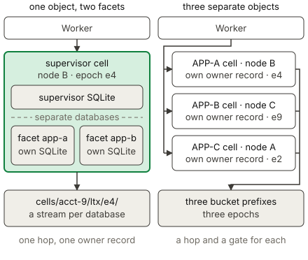

# Durable Object Facets

A facet is a child object inside a Durable Object. A supervisor class starts a
facet from a class that a [Worker Loader](dynamic-workers.md) provides, and the
supervisor and the facet then keep separate SQLite databases. An application
uses a facet to give generated or untrusted code durable storage without giving
that code a Durable Object namespace. The database of a facet replicates beside
the database of its root object, and the facet shares the ownership of the root
object. Read the
[Cloudflare Durable Object Facets documentation](https://developers.cloudflare.com/dynamic-workers/usage/durable-object-facets/)
for the standard API behavior.

## Example

The [facets example](../../examples/facets) creates a facet from a class that a
Worker Loader provides.

<!-- celld-example: facets -->

## A facet is a part of its root object

A facet is not a cell. celld keeps the SQLite database of a facet in a file of
its own, and it replicates that file as a stream of its own under the bucket
prefix of the root cell. A facet owns no ownership record and no fencing epoch.
It inherits both from the root cell, and its stream uses the epoch of the root
cell. The
[Durable Objects page](durable-objects.md#ownership-and-the-single-threaded-model)
describes that record and that epoch.

Containment also sets the lifecycle. A facet starts inside an event of the root
object, therefore the code of the facet runs on the node that owns the root
cell. celld releases every running facet when it releases the root cell, and the
startup callback runs again at the next call. An eviction, a reset, and a move
of ownership take the root object and its facets as one group, so a move proves
the stream of each facet before the new owner opens the root cell.

The storage of a facet is independent of the storage of its root object, as in
workerd. A write of a facet commits in the database of the facet, so a rollback
of a root storage transaction does not undo a facet call inside it. celld holds
an outbound effect of a facet, and the reply of a facet call, until the stream
of the facet proves the writes of that call. The effect also passes the output
gate of the root cell, because it can reveal what the root object showed the
facet.

## Starting and addressing a facet

`ctx.facets.get(name, callback)` returns a stub for the facet with that name,
and celld runs the callback only when the facet is not already running. The
callback takes no argument and returns a `class` and an optional `id`. `class`
is a `DurableObjectClass`, and two sources supply one. The first source is
`worker.getDurableObjectClass("App")` on a Worker Loader binding. The second is
`ctx.exports.App` for a `DurableObject` class that the Worker exports without a
storage migration, and that facet runs in the isolate of its root. `id` sets what
the facet reads at `ctx.id`, and the facet inherits the id of its root object
when the callback gives no `id`.

The name alone selects the database, so a later call that keeps the name and
changes the `id` still reaches the stored data. A name has a limit of 256 bytes.
A facet can start a facet of its own, to a total depth of 4 that counts the root
object. `ctx.facets.abort(name, reason)` stops a running facet and keeps its
database, and a call on the stopped stub then throws the given reason.
`ctx.facets.delete(name)` stops the facet and removes its database and the
database of every facet below it. The stub answers `fetch()` and the RPC methods
of the class. The stub itself is not a promise, and a pipelined property path is
unavailable, so a call must name one method.

## Choose a facet or a second Durable Object

Use a facet when the child state belongs to the parent. The supervisor sits on
the path of every call, so it can count a call, apply a quota, and refuse a
request before the child code runs. The facet stays on the owner node of the
root cell, therefore a call from the supervisor crosses no node boundary and
needs no second ownership record. A facet and its root object do not commit
atomically, because each database proves its own writes. An application that
needs one atomic commit must keep that state in one database.

Use a separate Durable Object when the children must scale apart. Each object
then takes its own id, its own ownership record, and its own owner node, so the
fleet can place two of them on two machines and the stop of one node affects one
of them. A caller can also address such an object directly with
[`idFromName()`](durable-objects.md#identity-and-addressing). No name reaches a
facet from outside its root object, and a facet that must serve external traffic
therefore needs a supervisor that forwards the request.

## Differences from Cloudflare

- A Durable Object binding cannot supply a facet class. A class with a storage
  migration cannot supply one either, because `ctx.exports` holds that class as
  a namespace.
- Each facet has a separate SQLite database, which celld replicates as a
  separate stream under the bucket prefix of the root Durable Object.
- A facet cannot set an alarm. `storage.setAlarm()` throws inside a facet, so
  the root object must hold the schedule.
- A facet stub is not awaitable, and a pipelined property path is unavailable.
- The `clone()` method is unavailable.

The [Cloudflare compatibility](../cloudflare-compat.md#services)
page lists the runtime APIs and the unsupported services.
